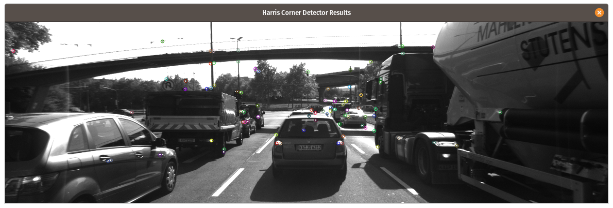
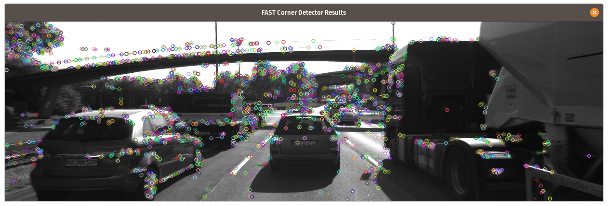
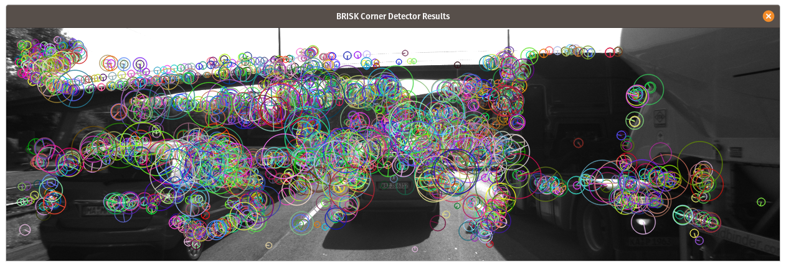
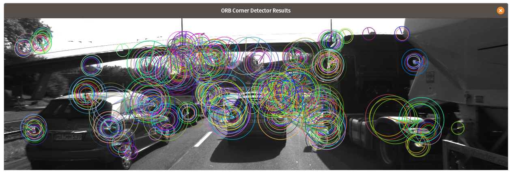
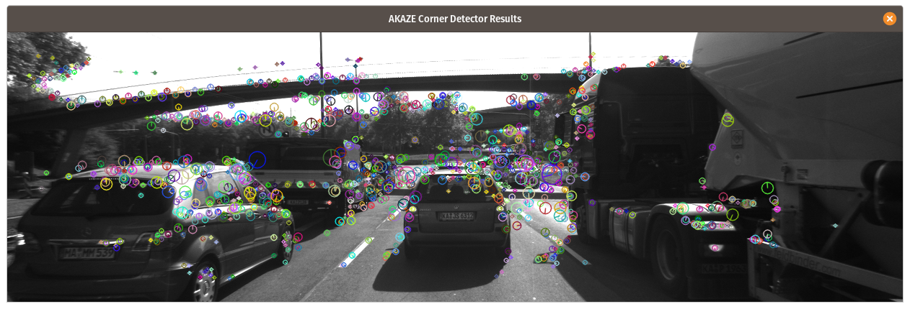
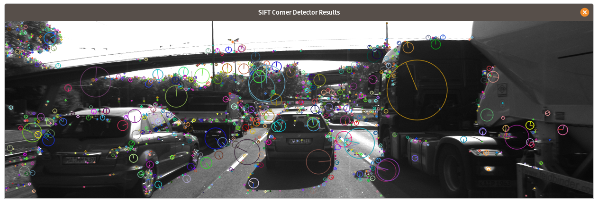

Performance Evaluation
======================

# Detected keypoints

Recorded number of detected keypoints on all 10 sample images for following detectors:

## Shi-Tomasi

Detected 13423 keypoints.

## Harris

Detected 728 keypoints.

## FAST

Detected 17874 keypoints.

## BRISK

Detected 27116 keypoints.

## ORB

Detected 5000 keypoints.

## AKAZE

Detected 13430 keypoints.

## SIFT

Detected 13861 keypoints.

# Keypoint Matches

Recorded number of matched keypoints for all 10 sample images (9 image pairs) for all detector/descriptor combinations.

_Note_: Matching is done using BF approach with the descriptor distance ratio set to 0.8.

| Detectors\Descriptors |    BRISK    |    BRIEF     |     ORB     |    FREAK     |     AKAZE    |     SIFT     |
| :-------------------: | :---------: | :----------: | :---------: | :----------: | :----------: | :----------: |
|       SHITOMASI       | 767 (5.7%)  | 944 (7.0%)   | 907 (6.8%)  | 766 (5.7%)   |  N/A         | 927 (6.9%)   |
|        HARRIS         | 129 (17.7%) | 146 (20.1%)  | 146 (20.1%) | 127 (17.5%)  |  N/A         | 147 (20.2%)  |
|         FAST          | 899 (5.0%)  | 1099 (6.2%)  | 1081 (6.1%) | 881 (4.9%)   |  N/A         | 1046 (5.6%)  |
|         BRISK         | 1570 (5.8%) | 1704 (6.3%)  | 1510 (5.6)  | 1526 (5.6%)  |  N/A         | 1646 (6.1%)  |
|          ORB          | 751 (15.0%) | 545 (10.9%)  | 761 (15.2%) | 421 (8.4%)   |  N/A         | 763 (15.3%)  |
|         AKAZE         | 1215 (9.1%) | 1266 (9.42%) | 1186 (8.8%) | 1188 (8.85%) |  1259 (9.4%) | 1271 (9.5%)  |
|         SIFT          | 592 (4.3%)  | 702 (5.1%)   |  OutOfMem   | 596 (4.3%)   |  N/A         | 800 (5.8%)   |

# Keypoints/Descriptor Extraction Time

| Detectors\Descriptors | BRISK |  BRIEF  |    ORB   | FREAK | AKAZE | SIFT |
| :-------------------: | :---: | :-----: | :------: | :---: | :---: | :--: |
|       SHITOMASI       |  96   |  91     |  105     |  233  |  N/A  |  184 |
|        HARRIS         |  85   |  81     |  97      |  232  |  N/A  |  187 |
|         FAST          |  19   |  14     |  27      |  186  |  N/A  |  116 |
|         BRISK         |  296  |  265    |  349     |  446  |  N/A  |  404 |
|          ORB          |  182  |  154    |  184     |  281  |  N/A  |  292 |
|         AKAZE         |  380  |  319    |  359     |  509  |  577  |  424 |
|         SIFT          |  633  |  617    | OutOfMem |  772  |  N/A  |  981 |

# Top 3 Detector/Descriptor Combinations Suggestion

- FAST + BREAF for best processing speed
- BRISK + BRIEF for the most keypoint matches
- FAST + ORB for 2nd fastest and good number of matches

