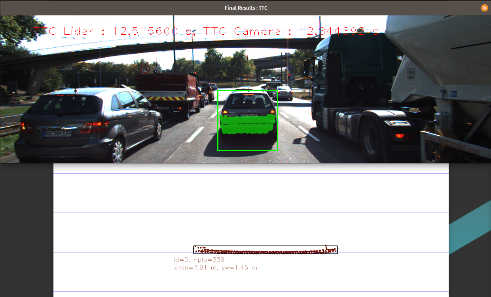
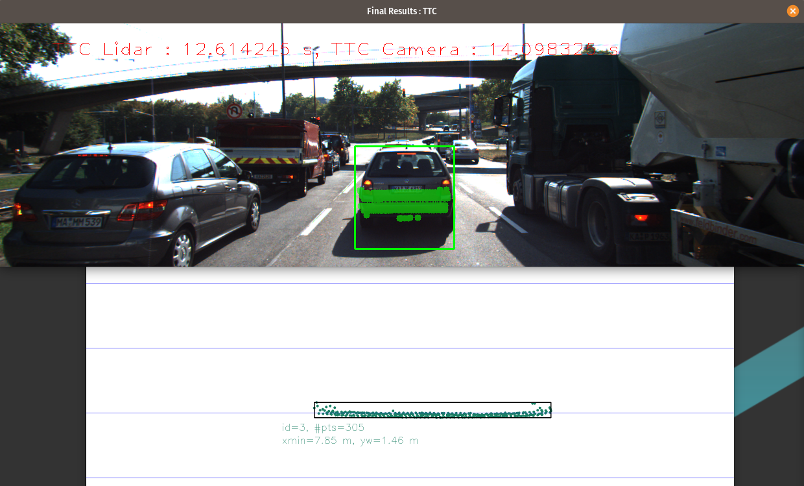
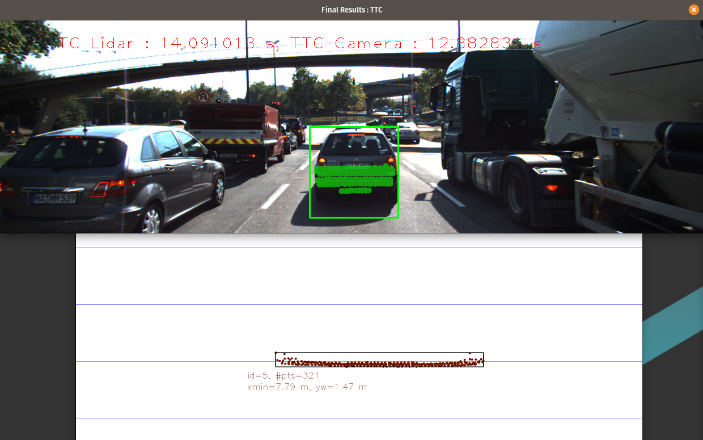

# FP.5 : Performance Evaluation 1

I haven't noticed significant problems with Lidar estimation. TTC was in range of 8.4s and 16.7s with only small changes between the consecutive frames. 
I believe the reason for that is I used medium lidar point instead of the minimal distace for TTC estimation. This approach proved to be more resilient to outliers and spreadout of the points.  

Below are some examples of the lidar scans. (all other scans can be found at *images/lidar_perf*.

  
  
  

